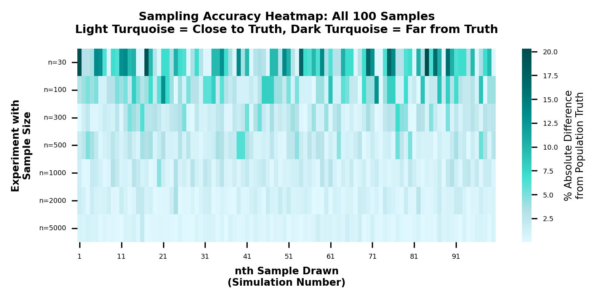

# Can 300 Taxi Rides Represent a Million Rides? Let's Test This in Real Life

**Experimental Supplement to Article #003: The Sample Size Paradox**

*By Vinay Thakur*
*September 20, 2025*

> **Disclaimer:** All data is sourced from publicly available information. This article represents my personal analysis and does not reflect my employer's views or any other entity associated or constitute professional advice. Mentioned entities / brands are not affiliated with or endorsed by me.

## Introduction

Recently, I posted a module in my Research Edge Series highlighting sample size sufficiency. To continue addressing intuitive gaps, I am sharing results from actual experiments using real population data to demonstrate how sampling works in practice.

While intuition serves as a powerful tool, objectively we all benefit from understanding established principles. For instance, theory of relativity cannot be easily explained in layman's language; if our intuition doesn't sync with it, that doesn't mean Einstein's theory is wrong.

## What I Did

I used the "New York City Taxi Trips 2019" dataset from Kaggle. This dataset originally contained over multi million transactions totaling >3 GB. Given the substantial download size, I took exactly first 1 million records from the original data as our complete population.

To keep analysis focused, I selected payment method used from this publicly available dataset. This simplifies demonstration without losing complexity.

## Experiment Design

### The Population Reality

Examining the complete population of 1 million transactions (publicly available on Kaggle) reveals:

- **Cash payments:** 330,095 transactions (33.01%)
- **Card payments:** 661,325 transactions (66.13%)
- **Other methods:** 8,580 transactions (0.86%)

These percentages represent the true population parameters, the ground truth that sampling estimates. In real scenarios, you rarely access complete population data. Having it here shows exactly how well sampling estimates perform.

### The 100-Sample Simulation

Instead of examining all 1 million records, the goal tests how often sampling leads to incorrect conclusions. Understanding sampling means recognizing the question isn't whether a single sample achieves perfect accuracy, but how often researchers would be wrong across multiple instances.

I drew 100 independent random samples for each sample size: 30, 100, 300, 500, 1,000, 2,000, and 5,000 transactions. Using Python's random sampling algorithms with simple random sampling without replacement, each sample remained independent and unbiased.

## Key Findings: Accuracy Peaks Early

The experiment shows the range of results researchers get when estimating the true cash payment percentage of 33.01%:

With smaller samples, results varied wildly - some estimates missed by nearly 20 percentage points. Larger samples kept even worst estimates much closer to truth.

### Sampling accuracy improves rapidly, then plateaus around n=300-500:

**Accuracy Progress:**

- **n=30:** ±13-20 percentage points - unreliable
- **n=100:** ±4-9 percentage points - risky
- **n=300:** ±3-5 percentage points - practical accuracy achieved
- **n=500:** ±3-6 percentage points - similar to 300

### Diminishing Returns:

Standard error improvements show where gains flatten:

- **n=30 to n=100:** 3.9 point improvement (45% better)
- **n=100 to n=300:** 2.1 point improvement (45% better)
- **n=300 to n=500:** 0.25 point improvement (only 10% better) - sharp drop-off
- **Beyond n=500:** Continued small gains with diminishing returns

**Key Insight:** Dramatic improvements happen early - n=30 to n=300 provides 6 percentage points of precision improvement. After n=300, gains become much smaller despite adding significantly more observations.

### Theoretical Validation

The experiment validated theoretical predictions across all sample sizes. Margin of error represents the range where the true value likely falls with 95% confidence:

Close alignment between theoretical and empirical results (averaging 98% accuracy) demonstrates that statistical theory reliably predicts real-world sampling behavior.

## Conclusion

The beauty lies in witnessing hundreds of year old mathematical theory play out accurately in contemporary data. When executed properly, sampling delivers reliable results across domains where it's applied correctly.

## Supporting Materials

### Experimental Data
- **Population Parameters:** [📊 Ground Truth Data](../assets/003-supplement-taxi-experiment/population_parameters.csv)
- **Sampling Results:** [📈 Statistical Validation](../assets/003-supplement-taxi-experiment/hundred_samples_summary.csv)

### Code Implementation
- **Complete Analysis:** [💻 Python Implementation](../assets/003-supplement-taxi-experiment/efficient_taxi_sampling.py)

### References
- **Data Source:** New York City Taxi Trips 2019 (Kaggle)
- **Main Article:** [The Sample Size Paradox](./003-sample-size-paradox.md)
- **Repository:** [Research Edge Series](https://github.com/vtmade/research-edge-series)

---

**Read more:** For those interested in the theoretical foundations, explore the Central Limit Theorem, Survey Sampling Theory, and Statistical Inference resources.

**Tools Used:** GenAI orchestration using Claude Code; Python with pandas for data manipulation, NumPy for random sampling and statistical calculations, and SQLite for database querying to extract and analyze the NYC taxi transaction data.